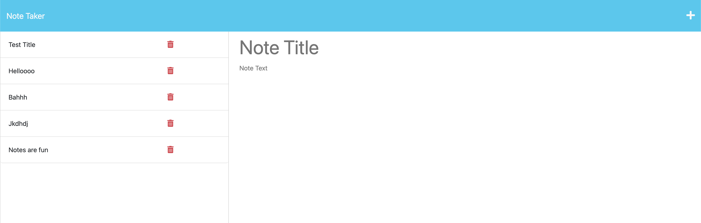

# Note Taker Starter Code

## Description
          
This app helps create, save and organize notes. It has a simple interface with a large area on the right to type and title the note. There is a save function, which saves and add the new note to the saved notes on the left hand side. There is a delete option to delete a saved note by clicking on the red trashcan next to the title of the note. Try it out for yourself below.

Preview Note Taker App  
 

## Usage

Go to the deployed app https://note-taker-slenorovitz-90d17c1ba8f8.herokuapp.com/notes and click the "Get Started" button to launch the application. Then a new note can be created and saved. 

## License

For more info check [MIT License](https://opensource.org/licenses/MIT)
    

## Contributing

N/A

## Tests

N/A

## Questions

For any issues, please contact me at:
slenorovitz@gmail.com
 
Or check out my Github page https://github.com/GypsyBoho
